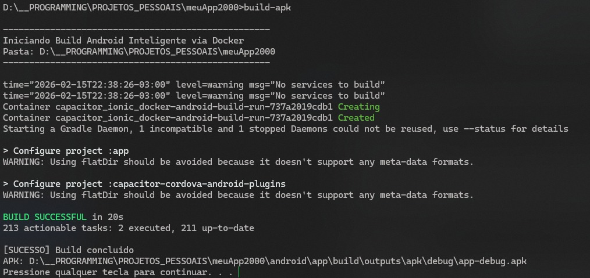

# DovaCore

### Criar apps híbridos para Android com Ionic Capacitor e sem Android Studio



Este guia foca na eficiência radical: o seu sistema hospeda o código (pnpm) e o Docker (Debian-based) resolve a compilação. Sem Android Studio, sem lixo, apenas o essencial.

**OBS.:** A primeira vez que você rodar o container e compilar vai demorar. É o preço do setup. Mas depois disso, é só alegria. Nada de instalar e configurar Android Studio e um monte de Bloatware que vem com ele.

[LEIA: "Como Otimizei Builds Android com Docker - 25 Segundos"](./Como-Otimizei-Builds-Android-com-Docker-25-Segundos.md)

[Repo que eu usava antes para compilar usando Github Actions, em cerca de 4 a 6 minutos](https://github.com/shuantsu/ionic-github-actions-apk)

## 1. Setup do Host (PowerShell)

Verifique e instale as ferramentas apenas se necessário.

1. **Node.js (via NVM):**
```
# Verifique se tem NVM
nvm version 
# Se não tiver, instale (https://github.com/coreybutler/nvm-windows)

nvm install 20 && nvm use 20

```


2. **PNPM & Ionic:**
```
npm install -g pnpm @ionic/cli

```


3. **Docker Desktop:** Certifique-se de que o motor está rodando.

## 2. Criando o Projeto

Substitua `MeuApp` pelo nome do seu projeto. Ao final do comando, o Ionic pedirá login: **digite "N"**.

```
ionic start MeuApp tabs --type=react --capacitor --pnpm
cd MeuApp

```

## 3. Desenvolvimento & Sincronia

Use o navegador para agilidade e o Docker apenas para o binário.

1. **Desenvolvimento, teste no navegador:** `pnpm ionic serve`
2. **Preparar Android:**
```
pnpm ionic build
npx cap add android  # (Só na 1ª vez)
npx cap sync         # (Sempre que mudar código/plugins)

```


## 4. O Build no Docker

Execute o comando de build pesado dentro do container isolado. A velocidade (25s) vem do cache do Gradle que deve estar configurado no seu `docker-compose.yml`.

```

docker compose build # (Só na 1ª vez)
# pode demorar dependendo da sua internet. Normalmente ele faz um download de 1Gb ou 2Gb

docker compose run --rm android-build bash -c "cd MeuApp/android && chmod +x gradlew && ./gradlew assembleDebug"
# primeira vez pode demorar uns 3 minutos, nas próximas é pra demorar cerca de 20 a 25 segundos

```

**Resultado:** `.\MeuApp\android\app\build\outputs\apk\debug\app-debug.apk`
